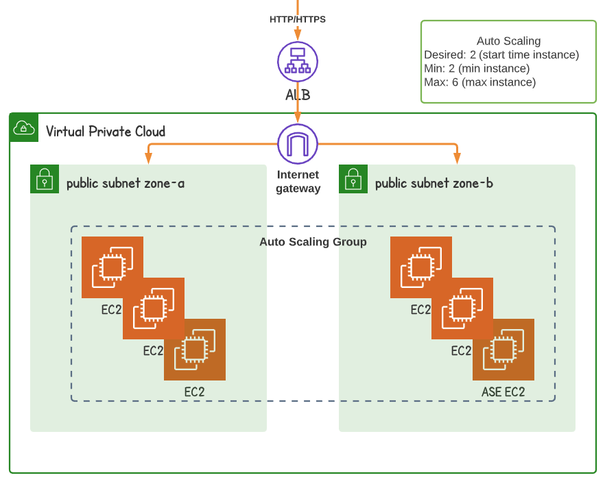

# Auto Scaling with ALB

Auto Scaling Groups allows you to dynamically control your server pool size – increase it, when your servers are processing more traffic or tasks than usual, or decrease it, when it become quieter.

As this demo is with application load balancer, we still need a VPC, minimum two subnets in different regions. 

I will skip to explain application load balancer and VPC, but rather focus on launch configuration and auto scaling group and its policy.

