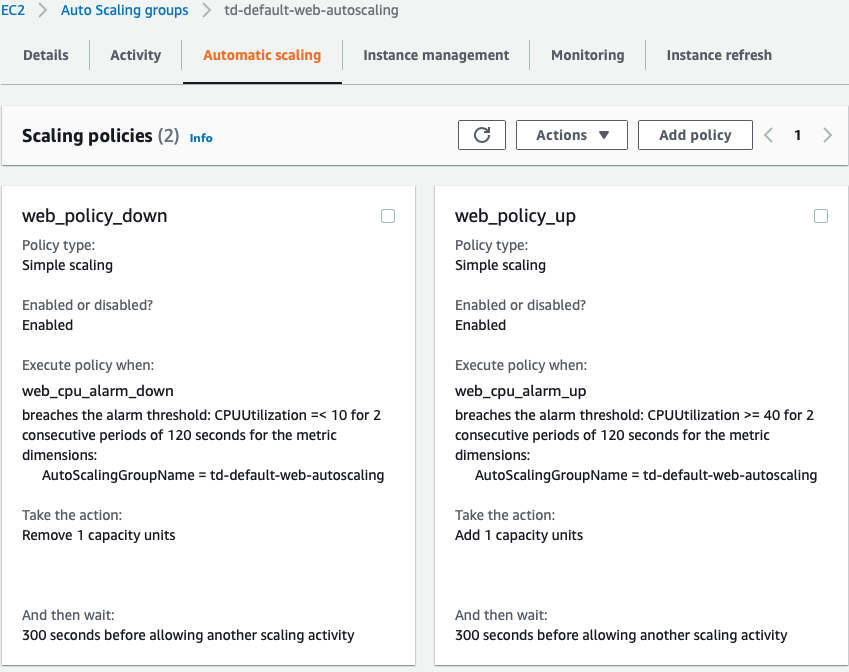

# Auto Scaling Policy with Cloudwatch

As mentioned in Auto Scaling Group section, Auto Scaling Group is just static configuration which has no given rules.   Auto Sacling Policy with Cloudwatch monitoring creates policy (i.e. rule) which allows to add or remove instances based on certain metrics.   

The following policy in AWS console is directly created from Terraform code below.




```sh
resource "aws_autoscaling_policy" "web_policy_up" {
  name                   = "web_policy_up"
  scaling_adjustment     = 1
  adjustment_type        = "ChangeInCapacity"
  cooldown               = 300
  autoscaling_group_name = aws_autoscaling_group.web.name
}

resource "aws_cloudwatch_metric_alarm" "web_cpu_alarm_up" {
  alarm_name          = "web_cpu_alarm_up"
  comparison_operator = "GreaterThanOrEqualToThreshold"
  evaluation_periods  = "2"
  metric_name         = "CPUUtilization"
  namespace           = "AWS/EC2"
  period              = "120"
  statistic           = "Average"
  threshold           = "40"

  dimensions = {
    AutoScalingGroupName = aws_autoscaling_group.web.name
  }

  alarm_description = "This metric monitor EC2 instance CPU utilization"
  alarm_actions     = [aws_autoscaling_policy.web_policy_up.arn]
}

resource "aws_autoscaling_policy" "web_policy_down" {
  name                   = "web_policy_down"
  scaling_adjustment     = -1
  adjustment_type        = "ChangeInCapacity"
  cooldown               = 300
  autoscaling_group_name = aws_autoscaling_group.web.name
}

resource "aws_cloudwatch_metric_alarm" "web_cpu_alarm_down" {
  alarm_name          = "web_cpu_alarm_down"
  comparison_operator = "LessThanOrEqualToThreshold"
  evaluation_periods  = "2"
  metric_name         = "CPUUtilization"
  namespace           = "AWS/EC2"
  period              = "120"
  statistic           = "Average"
  threshold           = "10"

  dimensions = {
    AutoScalingGroupName = aws_autoscaling_group.web.name
  }

  alarm_description = "This metric monitor EC2 instance CPU utilization"
  alarm_actions     = [aws_autoscaling_policy.web_policy_down.arn]
}


```