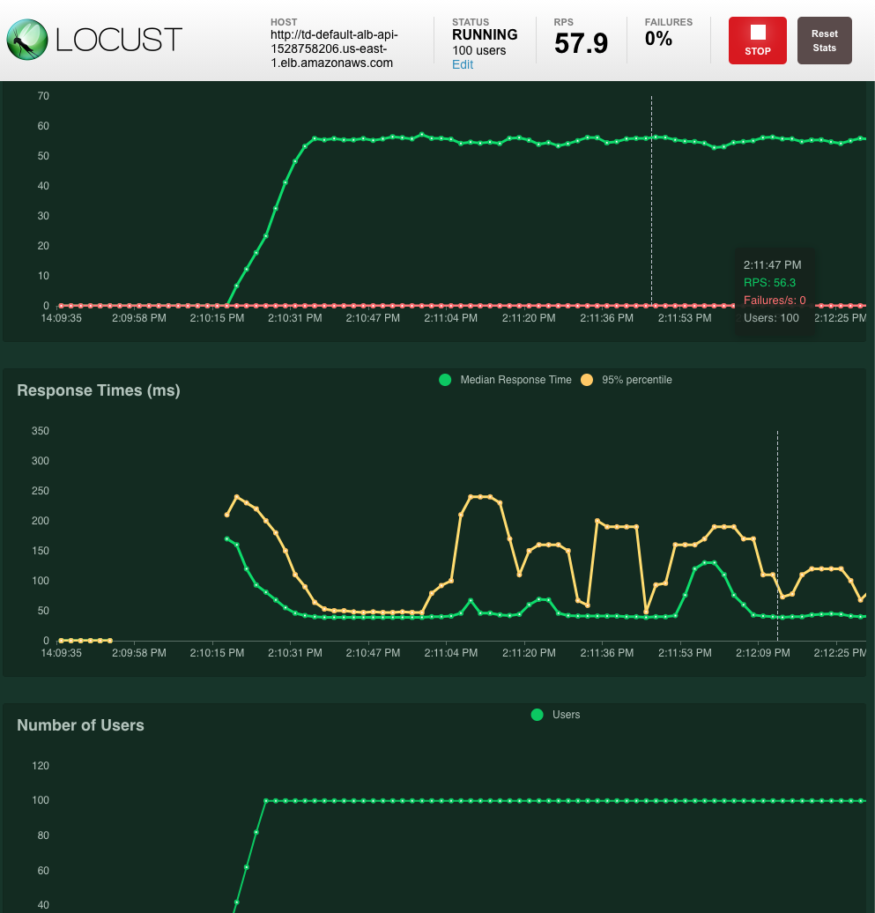

# Loading Test

We need traffic loading to the target instances in Auto Scaling Group to make sure auto scaling policy we created works as its intent.  

## Locust 
* Locust is open source loading test tool.  https://locust.io/
* This demo runs Locust in local machine, but it is better to deploy Locust master/workers nodes in Kubernetes.  You may not have enough bandwidth and CPU power with local machine to simulate real life traffic to the target Auto Scaling Group.      

```sh
$ locust -f locustfile.py
```

