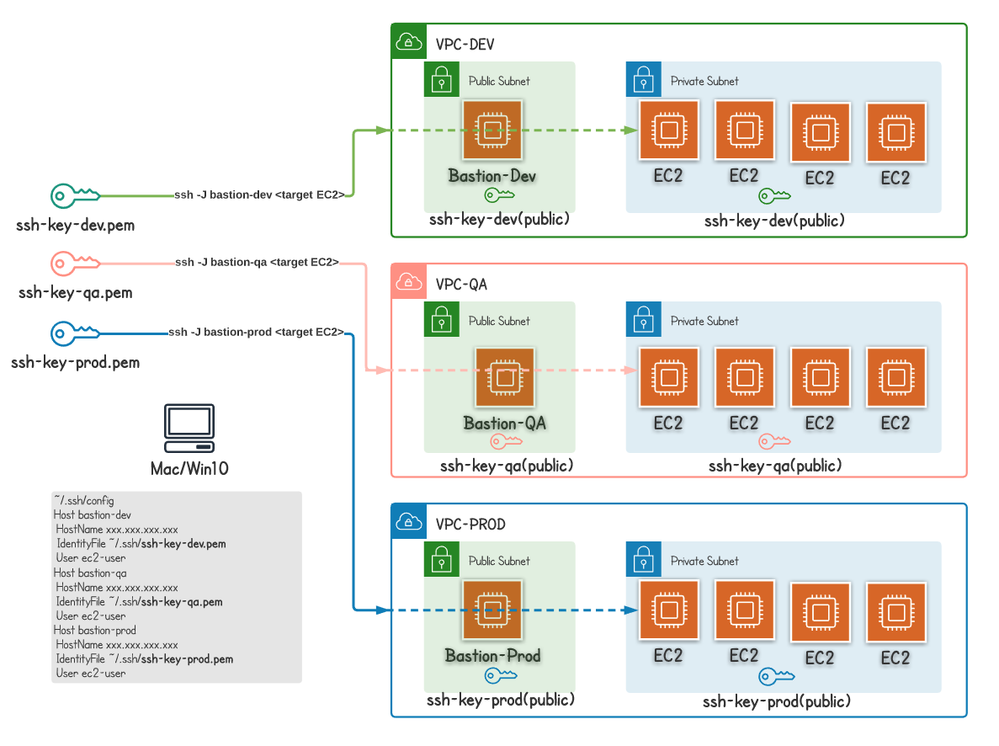

## Key Management

Private & public key pairs can be managed for each environment.
Store pem (private) key in a local machine safely, while Terraform manages to copy public key in each EC2 instances.  

