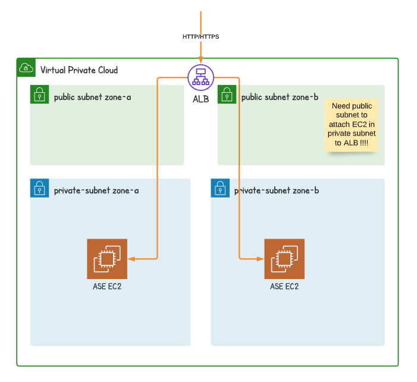

# Load balancer 
All of backend instances are in private subnets.  Let us briefly explain why we still need public subnet even though we probably don't place any backend instances in private subnets. 

Refer AWS document for detail https://aws.amazon.com/premiumsupport/knowledge-center/public-load-balancer-private-ec2/

Attach backend instances with private IP addresses to internet facing load-balancer.




## 1. Create public subnets for backend instances

  * Create a public subnet in each AZ that backend instances are located. 
  * If you have more than one private subnet in the same AZ, create only one public subnet for that AZ.
  * Confirm each public subnet has CIDR block with at least /27 (e.g. 10.0.0.0/27).
  * Confirm each subnet has at least 8 free IP address

## 2. Configure load balancer


  * Associate the public subnets with your load balancer 
  * Register the backend instances with your load balancer


## 3. Configure load balancer security group

## 4. Review recommend security group.  

Refer ```deploy/load_balancer.tf``` which follows aforementioned AWS recommendation.