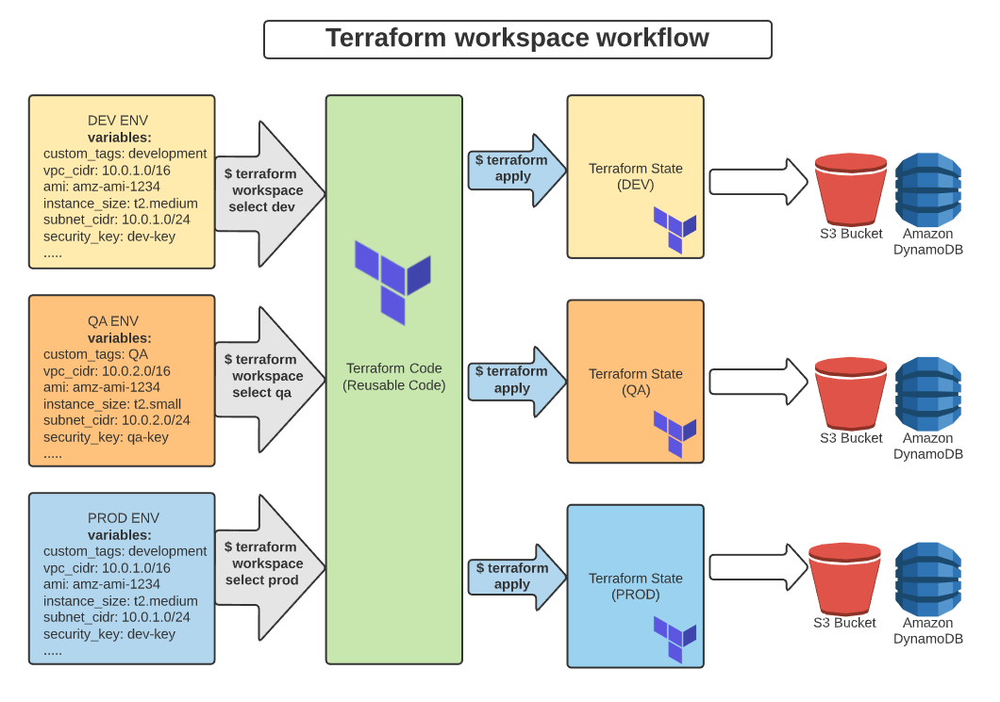
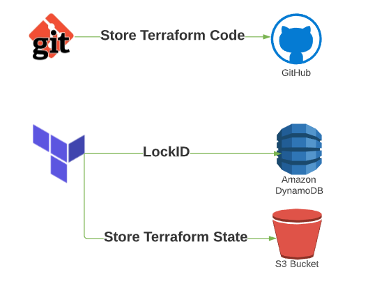
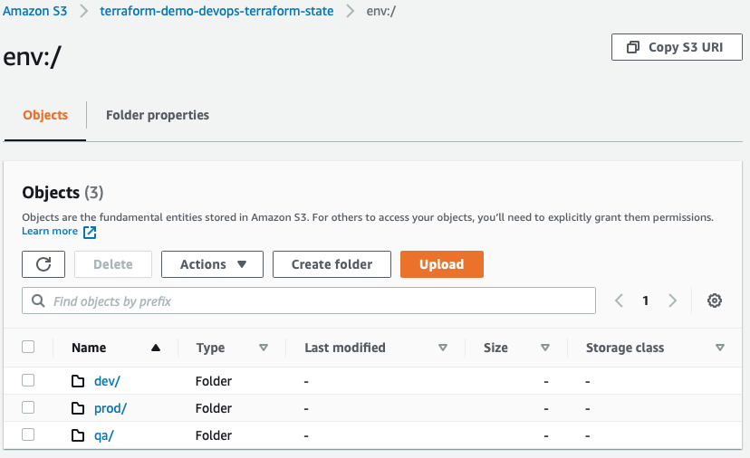

We can follow ```DRY (Don't Repeat Yourself) principle``` as much as possible. 


# Workspaces
The successor to Terraform environments.  "workspaces" allow you to sperate your state
and infrastructure without changing anything in the main code.   Each workspace would be considered as its own environment.  The following diagram shows how ```workspace``` plays for different environments with their own configurations.



Note that we only need to create a ```S3 bucket``` and a ```DynamoBD table```.  Terraform will create keys accordingly based on a selected workspace.   


The following is Terraform command with "workspace".   "default" is the one crated by default.  If you don't create a workspace, you actually run terraform within "default" workspace.  

```sh
# if "dev" workspace is not created
$ terraform workspace new dev 
# select "dev" workspace is not selected
$ terraform workspace select dev 
$ terraform apply

# to check the current workspace. if development, it prints development
$ terraform workspace show
development

# to see the list of workspaces and selected workspace.
$ terraform workspace list
  default
  dev
* prod
  qa
```

The following is part of "main.tf" file.  This is an example showing that we can choose different VPC, different subnets and different ```instance_type``` based on a selected workspace.   

```sh
# main.tf 
locals {
  env = {
    default = {
      instance_type         = "t2.micro"
      vpc_cidr              = "10.2.0.0/16"
      public_subnet_a_cidr  = "10.2.0.0/24"
      public_subnet_b_cidr  = "10.2.1.0/24"
      private_subnet_a_cidr = "10.2.5.0/24"
      private_subnet_b_cidr = "10.2.6.0/24"
      key_name              = var.ec2_key_name_default

    }
    dev = {
      instance_type         = "t2.micro"
      vpc_cidr              = "10.3.0.0/16"
      public_subnet_a_cidr  = "10.3.0.0/24"
      public_subnet_b_cidr  = "10.3.1.0/24"
      private_subnet_a_cidr = "10.3.5.0/24"
      private_subnet_b_cidr = "10.3.6.0/24"
      key_name              = var.ec2_key_name_dev
    }
    qa = {
      instance_type         = "t2.micro"
      vpc_cidr              = "10.4.0.0/16"
      public_subnet_a_cidr  = "10.4.0.0/24"
      public_subnet_b_cidr  = "10.4.1.0/24"
      private_subnet_a_cidr = "10.4.5.0/24"
      private_subnet_b_cidr = "10.4.6.0/24"
      key_name              = var.ec2_key_name_qa
    }
    prod = {
      instance_type         = "t2.micro"
      vpc_cidr              = "10.5.0.0/16"
      public_subnet_a_cidr  = "10.5.0.0/24"
      public_subnet_b_cidr  = "10.5.1.0/24"
      private_subnet_a_cidr = "10.5.5.0/24"
      private_subnet_b_cidr = "10.5.6.0/24"
      key_name              = var.ec2_key_name_prod
    }
  }

```

# Remote State

Keeping Terraform state in a remote file is a must.  Terraform backend easily support S3 bucket as remote state storage.   You can additionally set up a DynamoDB table to manage LockID state.  

The following shows how LockID in DynamoDB prevents accessing terraform state in S3 bucket simultaneously.

```sh
  Destroy complete! Resources: 44 destroyed.
  Releasing state lock. This may take a few moments...
```


Each of environments are required for separate state files to avoid collision.   With the use of ```workspace``` name, Terraform creates "env:/" with ```workspace``` named directories and stores corresponding states in created workspace folders.   You only need one S3 bucket and one DynamoDB table set up to store multiple workspace states (It is that easy....!)




# Locals

Terraform ```locals```  are named values that you can refer to in your configuration. You can use local values to simplify your Terraform configuration and avoid repetition. Local values (locals) can also help you write more readable configuration by using meaningful names rather than hard-coding values. 

# Variables

```Variables``` in Terraform are a great way to define centrally controlled reusable values. The information in Terraform variables is saved independently from the deployment plans, which makes the values easy to read and edit from a single file.

# Modules

```Modules``` are generic like any languages. It is parametrized code that can be reused in multiple cases.  Modules help DRY policy.


