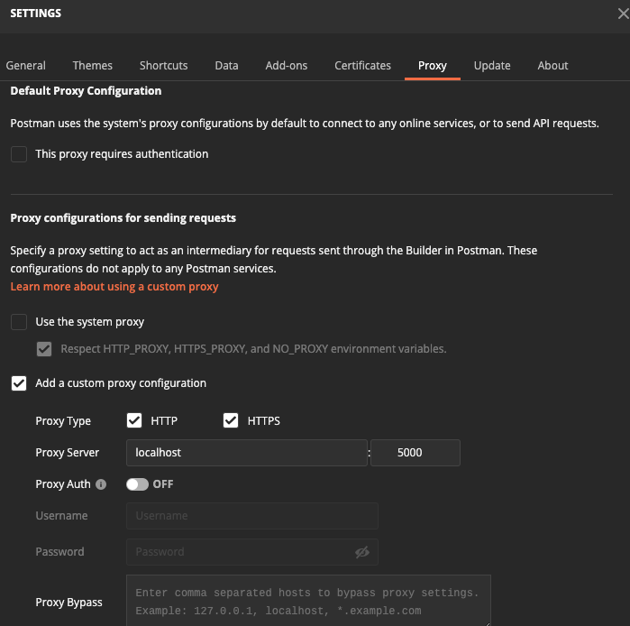
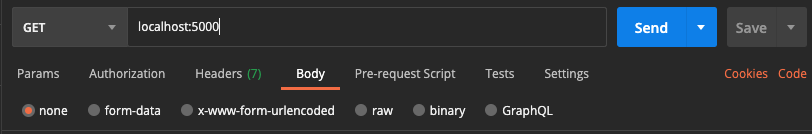

# Postman access via SSH tunnel
Postman supports SOCKS proxy.  We can route Postman application through a SOCKS proxy via SSH. 

## Step 1. Install http-proxy-to-socks

If you don't have npm installed, install ```node.js```  https://nodejs.org/en/.  

```sh
$ npm install -g http-proxy-to-socks
```

## Step 2. SSH tunneling and start http-proxy-to-socks

```sh
# start ssh tunneling.  
$ ssh -D 5001 -J bastion-instance root-user@target-instance

# run htps installed in Step 1.  Port 5000 is reachable port at target instance.
# flask port 5000 is open to outside in EC2, then assign port 5000
$ hpts -s 127.0.0.1:5001 -p 5000
```

For example,

```sh
# target instance you want to tunnel into.
$ ssh -D 5001 -J bastion-instance ec2-user@10.5.6.237  
$ hpts -s 127.0.0.1:5001 -p 5000
```

## Step 3. Configure HTTP proxy in Postman.  



## Step 4. Make a request from Postman.  

You actually request to ```localhost``` with target EC2 port, then ```http proxy``` is changed to ```Socks``` through SSH tunnel.




