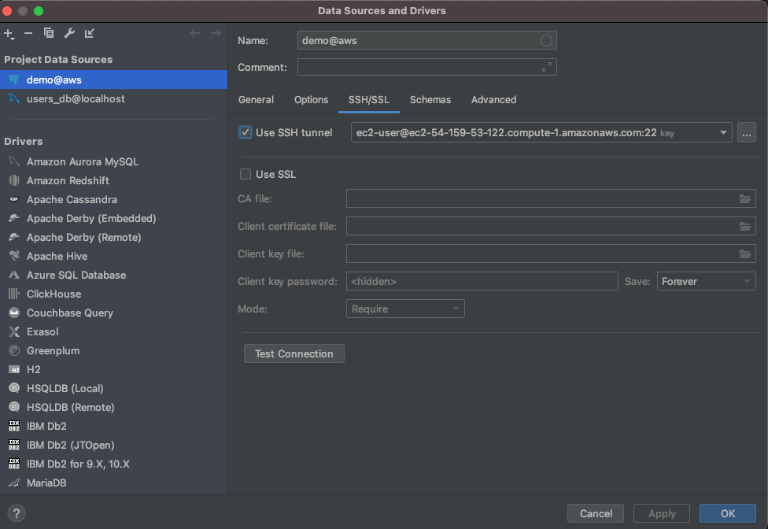

# Postgres Database Access via SSH tunnel

From Bastion, you can connect to Postgress DB host.  

```sh
$ sudo yum install postgresql
$ psql --host=<postgres db endpoint> --port=5432 --username=demo --password --dbname=demo
```

We can also use DB client with GUI built-in such as DataGrip.

## Step 1. Set up  DB host.  Enter DBhost URL as below.


## Step 2. Set up SSH tunnel.  Enter Bastion host URL as below.

